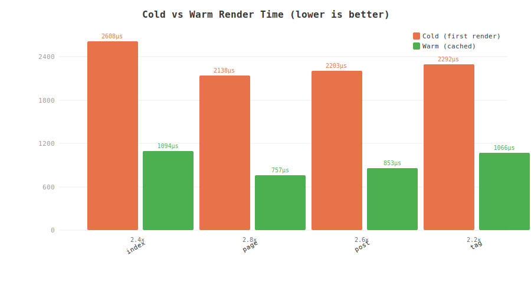

# Giom

Giom is an indentation-based template language for Go applications. It compiles
GION templates to Gad bytecode and is designed for server-side rendering with a
small API, reusable components, slots, imports, and HTML-oriented syntax.

The current project root contains the new implementation. The old implementation
and old samples were removed.

## Features

- Indentation-based HTML templates
- Components with named parameters and named slots
- `@import` friendly template organization
- Gad expressions and statements inside templates
- HTML tag shorthand for ids, classes, and attributes
- Transpilation to Gad AST/source for inspection
- Go embedding through `Compile` and Gad VM execution
- CMS example application in `examples/cms`

## Quick Template

```giom
@main
    !!! 5
    html[lang="en"]
        head
            title Hello
        body
            main.container
                h1 {= Title}
                p Welcome to Giom.
```

## Component Example

```giom
@export comp page(title)
    !!! 5
    html
        head
            title {= title}
        body
            @slot main

@main
    +page("Docs")
        h1 Documentation
        p This content is passed to the main slot.
```

## Go Usage

```go
package main

import (
    "bytes"
    "log"

    "github.com/gad-lang/gad"
    "github.com/gad-lang/giom"
)

func main() {
    src := []byte(`@main
    p Hello {= Name}
`)

    builtins := giom.AppendBuiltins(gad.NewBuiltins())
    st := gad.NewSymbolTable(builtins.NameSet)
    if _, err := st.DefineGlobals([]string{"Name"}); err != nil {
        log.Fatal(err)
    }

    _, bc, err := giom.Compile(st, src, gad.CompileOptions{})
    if err != nil {
        log.Fatal(err)
    }

    var out bytes.Buffer
    vm := gad.NewVM(builtins.Build(), bc)
    ret, err := vm.RunOpts(&gad.RunOpts{
        StdOut:  &out,
        Globals: gad.Dict{"Name": gad.Str("Giom")},
    })
    if err != nil {
        log.Fatal(err)
    }

    // A compiled template builds a render tree and returns its root element;
    // walk it to write the HTML output.
    if el, ok := ret.(giom.Element); ok {
        if _, err := el.WriteTo(vm, &out); err != nil {
            log.Fatal(err)
        }
    }

    log.Print(out.String())
}
```

`giom.Compile` is shorthand for `giom.NewCompiler(st, opts).Compile(src)`. Give
each independent template its own symbol table (a compiled template binds a root
tag at the module top level), or use the caching [`Render`](docs/embedding.md)
struct, which handles this for you.

## Documentation

- [Getting Started](docs/getting-started.md)
- [Template Syntax](docs/syntax.md)
- [Components And Slots](docs/components-and-slots.md)
- [Embedding In Go](docs/embedding.md)
- [API Reference](docs/api.md)
- [Examples Cookbook](docs/examples.md)
- [CMS Example](docs/cms-example.md)
- [Project Structure](docs/project-structure.md)

## Repository Layout

```text
.
├── compiler.go          # Giom compiler entry points
├── builtins.go          # HTML and write builtins
├── render.go            # High-level Render struct with caching
├── importer.go          # FileImporter for @import resolution
├── node/                # Giom AST nodes and Gad conversion
├── parser/              # Indentation parser and scanner
├── token/               # Giom token definitions
├── examples/cms/        # Full CMS example
└── docs/                # User documentation
```

## CMS Example

```sh
cd examples/cms
go run .
```

Open `http://localhost:8080/`. The app creates `cms.db` on first run and seeds
the database from `seed.yaml` only when `cms.db` does not already exist.

## Benchmarks (CMS Example)

Results from `examples/cms` on AMD Ryzen 7 5700G.

### Cold vs Warm Render Time



Bytecode caching reduces render time by 2–3× across all template types.
Cold (first) render includes compilation; warm (subsequent) renders reuse
cached bytecode. Run with `go test -bench=BenchmarkColdVsWarmChart ./examples/cms`.

### Warm (Cached) Template Routes (500ms benchtime, 3 runs)

| Route | ns/op | B/op | allocs/op |
|---|---|---|---|
| `/` (index) | 1,027,000 | 749,424 | 7,908 |
| `/pages/about` | 678,287 | 574,279 | 4,438 |
| `/pages/guides` | 666,918 | 567,403 | 4,271 |
| `/pages/contact` | 677,064 | 574,323 | 4,438 |
| `/posts/designing-fast-editorial-pages` | 819,535 | 629,675 | 5,488 |
| `/posts/sqlite-compact-cms` | 792,234 | 615,586 | 5,157 |
| `/posts/modern-admin-interfaces` | 806,615 | 617,288 | 5,190 |
| `/posts/reusable-gion-components` | 809,749 | 621,317 | 5,288 |
| `/posts/shipping-friendly-first-page` | 795,117 | 619,889 | 5,257 |
| `/posts/building-gallery-component` | 827,598 | 633,974 | 5,588 |
| `/tags/design` | 1,053,072 | 706,459 | 6,943 |
| `/tags/engineering` | 1,038,128 | 700,075 | 6,804 |
| `/tags/news` | 979,927 | 664,407 | 6,021 |
| `/tags/tutorials` | 966,278 | 670,582 | 6,154 |

### Multi-Request Benchmarks

| Benchmark | ns/op | B/op | allocs/op |
|---|---|---|---|
| SequentialNavigation (14 pages) | 12,001,483 | 9,080,927 | 79,790 |
| ColdRender (compile + render) | 25,082,682 | 2,338,816 | 28,114 |
| MixedWorkload (4 pages) | 3,580,932 | 2,701,861 | 25,022 |
| PostWithRelatedContent (4 posts) | 3,232,344 | 2,515,971 | 21,211 |
| TagWithPagination (4 tags, page=1) | 4,052,386 | 2,777,445 | 26,019 |

ColdRender creates a fresh server for each iteration (no cache). All others
share a single server (bytecode cached after first request). Show with
`go test -bench=. -benchmem ./examples/cms`.

## Build

```sh
go build ./...
```

For the CMS module:

```sh
cd examples/cms
go build .
```

## License

See [LICENSE](LICENSE).
