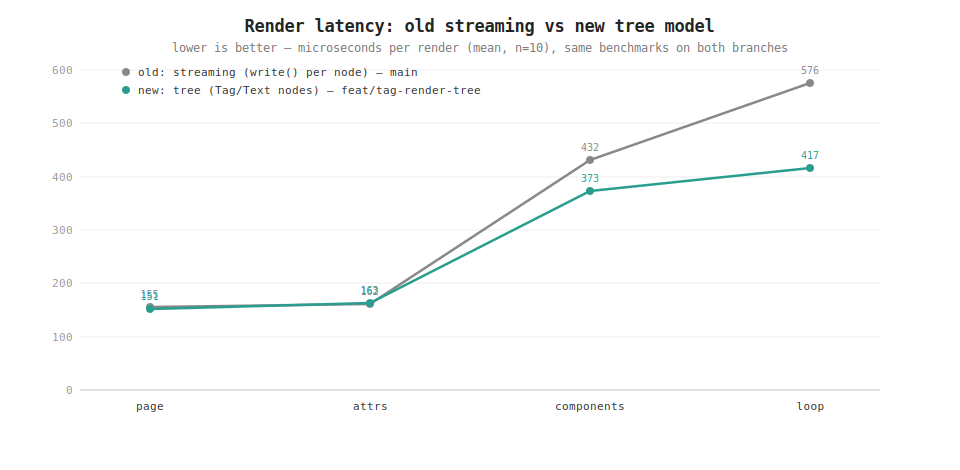
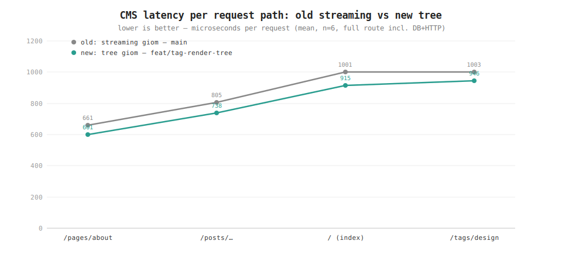
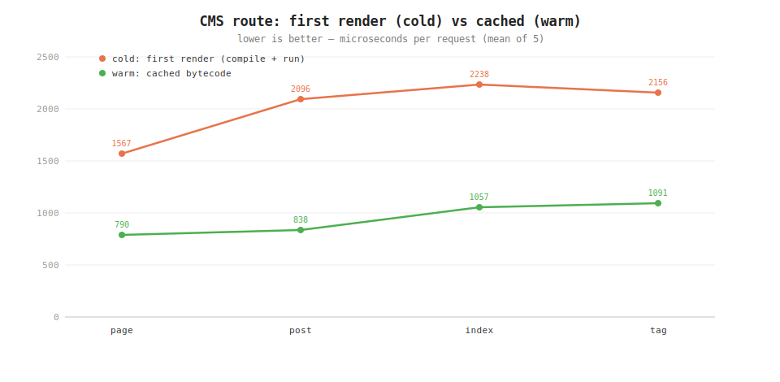
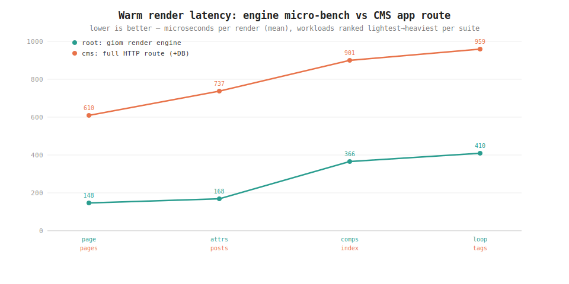

# Benchmarks

This report covers two comparisons:

1. **Old vs new implementation** — the previous *streaming* render model (`main`,
   where every tag/text lowers to `write()` calls) against the new *tree* model
   (tags build `Tag`/`Text` nodes returned as a tree), running **identical**
   benchmarks on both branches: at the engine level
   ([`bench_test.go`](../bench_test.go)) and per CMS request path
   ([`examples/cms/bench_test.go`](../examples/cms/bench_test.go)).
2. **Engine vs full app** — the giom render engine against the CMS's full HTTP
   routes, including a cold-vs-cached breakdown.

Environment: `go1.26.5 linux/amd64`, AMD Ryzen 7 5700G. `benchstat`, n=10.
Reproduce with the commands in [Running](#running).

## Old vs new: streaming → tree render model

Same benchmarks on `main` (streaming) and `feat/tag-render-tree` (tree):



The new tree model is **faster and allocates less**, and the gain grows with the
number of rendered nodes:

### Render (`benchstat`, old = streaming, new = tree)

| Template | old µs | new µs | Δ time | old allocs | new allocs | Δ allocs |
|----------|-------:|-------:|:------:|-----------:|-----------:|:--------:|
| `page` | 154.6 | 150.9 | −2.4% | 1,219 | 1,098 | −9.9% |
| `attrs` | 162.3 | 163.0 | ~ | 1,298 | 1,224 | −5.7% |
| `components` (×20) | 432.2 | 372.6 | **−13.8%** | 5,631 | 4,711 | **−16.3%** |
| `loop` (×50) | 575.8 | 417.3 | **−27.5%** | 8,358 | 6,059 | **−27.5%** |
| **geomean** | 144.5 | 132.2 | **−8.5%** | 1,500 | 1,357 | **−9.5%** |

Memory per op tracks the alloc counts (render geomean −6.4% B/op; `loop`
−17% B/op).

### Compile (`benchstat`)

| Template | old µs | new µs | Δ time |
|----------|-------:|-------:|:------:|
| `page` | 84.9 | 77.6 | −8.6% |
| `attrs` | 51.2 | 48.3 | −5.7% |
| `loop` | 50.7 | 46.2 | −8.9% |
| `components` | 138.2 | 140.8 | +1.9% |

**Why the tree model wins:** the streaming model emitted a separate `write(...)`
VM call for every tag open, attribute group, close and text fragment; the tree
model instead builds compact `Tag`/`Text` objects and walks them once in Go at
the end. That means fewer VM operations and allocations per node, so node-heavy
templates (`loop`, `components`) improve the most while tiny ones (`page`,
`attrs`) are roughly flat. Compilation is also slightly leaner because the
per-node `write()` lowering is replaced by a single file-level tree wrapper
(`components` is the one case that adds a little, since every component body gets
its own fragment wrapper).

## Old vs new: CMS request paths

The same `BenchmarkRoutes` run against the whole example app on both branches —
the only variable is the giom dependency (streaming vs tree); the app code, gad
version, SQLite data and HTTP path are identical. Each figure is one full request
(router → SQLite → model → render → response), warm.



Every route gets **faster and much leaner** — even end-to-end, where the render
engine is only part of the work:

| Request path | old µs | new µs | Δ time | Δ allocs |
|--------------|-------:|-------:|:------:|:--------:|
| `GET /` (index) | 1,001 | 915 | −8.6% | −22.4% |
| `GET /pages/about` | 661 | 601 | −9.2% | −22.2% |
| `GET /pages/guides` | 650 | 594 | −8.6% | −21.5% |
| `GET /pages/contact` | 661 | 605 | −8.6% | −22.2% |
| `GET /posts/designing-fast-editorial-pages` | 805 | 738 | −8.3% | −21.3% |
| `GET /posts/sqlite-compact-cms` | 780 | 712 | −8.7% | −21.8% |
| `GET /posts/modern-admin-interfaces` | 790 | 735 | ~ | −20.8% |
| `GET /posts/reusable-gion-components` | 793 | 732 | −7.6% | −21.0% |
| `GET /posts/shipping-friendly-first-page` | 784 | 718 | −8.4% | −22.0% |
| `GET /posts/building-gallery-component` | 808 | 757 | −6.2% | −21.5% |
| `GET /tags/design` | 1,003 | 946 | −5.7% | −20.7% |
| `GET /tags/engineering` | 983 | 932 | −5.2% | −21.3% |
| `GET /tags/news` | 942 | 880 | −6.6% | −21.3% |
| `GET /tags/tutorials` | 957 | 896 | −6.4% | −20.5% |
| **geomean** | 821 | 759 | **−7.5%** | **−21.5%** |

Memory drops too (B/op geomean −10.1%). The allocation win (**−21%**) is larger
than the time win because the streaming model made a `write()` VM call — each
allocating — for every tag open, attribute group, close and text run; the tree
model builds a handful of compact `Tag`/`Text` objects per node instead. That
allocation cut survives all the way through the DB query and HTTP layer, which is
why it shows up per request path.

## Engine micro-benchmarks — absolute (tree branch)

### Render — steady state (bytecode cache warm)

| Template | µs/op | B/op | allocs/op |
|----------|------:|-----:|----------:|
| `page` (small document, 7 tags) | 151 | 386,149 | 1,098 |
| `attrs` (attribute-heavy tags) | 163 | 390,861 | 1,224 |
| `components` (20× component + slot) | 373 | 539,800 | 4,711 |
| `loop` (50-row `@for`) | 417 | 579,504 | 6,059 |

### Compile — one-time (parse + convert + compile to bytecode)

| Template | µs/op | B/op | allocs/op |
|----------|------:|-----:|----------:|
| `page` | 78 | 57,710 | 799 |
| `attrs` | 48 | 37,733 | 483 |
| `loop` | 46 | 38,905 | 526 |
| `components` | 141 | 104,153 | 1,480 |

Compilation is one-time and cached by `Render`, so the warm render figures are
what matter in steady state.

> Each `Render` call also re-reads the template file, builds a fresh symbol table
> and rebuilds the static builtins table — fixed overhead common to both branches
> and to the CMS suite, so treat these as end-to-end figures, not pure tree-walk
> cost.

## CMS app benchmarks (`examples/cms/bench_test.go`)

`BenchmarkRoutes`, warm (each route's bytecode cached; every iteration still runs
the router, the SQLite query and the render):

| Route | µs/op | B/op | allocs/op |
|-------|------:|-----:|----------:|
| `GET /` (index) | 901 | 646,415 | 6,209 |
| `GET /pages/about` | 610 | 508,358 | 3,525 |
| `GET /pages/guides` | 594 | 504,658 | 3,427 |
| `GET /pages/contact` | 610 | 508,249 | 3,525 |
| `GET /posts/designing-fast-editorial-pages` | 737 | 553,562 | 4,391 |
| `GET /posts/sqlite-compact-cms` | 712 | 542,046 | 4,106 |
| `GET /posts/modern-admin-interfaces` | 723 | 545,766 | 4,183 |
| `GET /posts/reusable-gion-components` | 731 | 548,525 | 4,253 |
| `GET /posts/shipping-friendly-first-page` | 709 | 544,766 | 4,176 |
| `GET /posts/building-gallery-component` | 757 | 560,866 | 4,462 |
| `GET /tags/design` | 959 | 621,452 | 5,581 |
| `GET /tags/engineering` | 943 | 614,584 | 5,428 |
| `GET /tags/news` | 885 | 583,596 | 4,816 |
| `GET /tags/tutorials` | 922 | 590,358 | 4,965 |

### First render (cold) vs cached (warm)

`BenchmarkColdVsWarmChart` measures a route's **first** request — which parses,
converts and compiles the template before rendering — against a subsequent
request served from cached bytecode. Each figure is the mean of 5 single requests
(`time.Now()` around one `ServeHTTP`), so it captures the first-hit latency a user
actually sees rather than an amortized `b.N` average.



| Route | Cold (first) µs | Warm (cached) µs | Speedup |
|-------|----------------:|-----------------:|--------:|
| `page` (`/pages/about`) | 1,567 | 790 | 2.0× |
| `post` (`/posts/…`) | 2,096 | 838 | 2.5× |
| `index` (`/`) | 2,238 | 1,057 | 2.1× |
| `tag` (`/tags/design`) | 2,156 | 1,091 | 2.0× |

Compilation roughly **doubles** first-request latency; the `Render` cache pays
for itself on the very next request. (These single-shot means run higher than the
amortized `BenchmarkRoutes` warm figures above — e.g. index 1,057 µs here vs
901 µs — because the amortized loop reuses more warmed state per iteration.) A
column-chart variant is at [`bench-cold-vs-warm.svg`](bench-cold-vs-warm.svg)
(generated by the example's own `chart.go`).

## Engine vs full request

Engine micro-benchmarks (**root**, teal) next to full CMS route latency (**cms**,
orange), each ranked lightest→heaviest:



The vertical gap is the per-request overhead outside the render engine — routing,
the SQLite query and model assembly. The engine line stays in the ~150–420 µs band
while the app line runs ~610–960 µs, so the render engine is a *fraction* of
end-to-end route latency.

## Takeaways

- **The tree model is a net win over streaming** on the same benchmarks. At the
  engine level: −8.5% render time and −9.5% allocations at geomean, up to −27% on
  node-heavy templates. Per CMS request path (end-to-end, incl. DB + HTTP): −7.5%
  time and **−21.5% allocations** on every route — while also enabling the
  returned render tree.
- **Warm render is the steady state.** Compilation is a one-time cost the `Render`
  cache absorbs: it roughly doubles the *first* request (2.0–2.5×), then every
  subsequent request runs only the render path.
- **The engine is a minor share of a real request.** A CMS page route (~610 µs)
  spends only part of its time in giom; routing + SQLite + model assembly dominate.
- **Cost tracks tree size** in every measurement: loops, multi-component pages and
  large tag listings are the heaviest.

## Running

```sh
# Engine micro-benchmarks (repo root)
go test -run '^$' -bench 'BenchmarkRender|BenchmarkCompile' -benchmem -count=10 ./

# Old vs new: run the same on a `main` worktree and compare with benchstat
git worktree add ../giom-main main
cp bench_test.go ../giom-main/
( cd ../giom-main && go test -run '^$' -bench 'BenchmarkRender|BenchmarkCompile' \
    -benchmem -count=10 ./ > old.txt )
go test -run '^$' -bench 'BenchmarkRender|BenchmarkCompile' -benchmem -count=10 ./ > new.txt
benchstat ../giom-main/old.txt new.txt
git worktree remove ../giom-main

# CMS app benchmarks
cd examples/cms
go test -run '^$' -bench 'BenchmarkRoutes' -benchmem -count=4 .
# Cold vs cached numbers (-v prints per-route cold/warm/speedup)
go test -run '^$' -bench 'BenchmarkColdVsWarmChart' -benchtime=1x -v .

# Old vs new, per request path: run the CMS benchmarks in the `main` worktree
# too, after aligning its gad pin and applying the same test fix (copy this
# branch's examples/cms go.mod, go.sum, helpers_test.go, handlers_test.go into
# ../giom-main/examples/cms), then:
( cd ../giom-main/examples/cms && go test -run '^$' -bench 'BenchmarkRoutes' \
    -benchmem -count=6 . > old_cms.txt )
go test -run '^$' -bench 'BenchmarkRoutes' -benchmem -count=6 . > new_cms.txt
benchstat ../giom-main/examples/cms/old_cms.txt new_cms.txt
```
